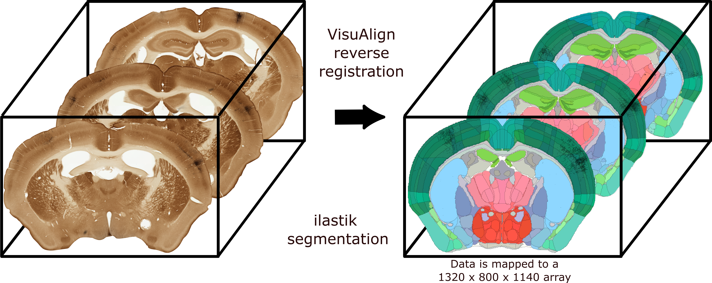

# Population_Integrator
A modular pipeline for segmentation, registration, and analysis of large-scale high-resolution 
neuro-anatomical imaging data.

Designed for scalable integration of neuroanatomical connectivity data
across experiments and spatial reference frames.

Raw Data → Segmentation → Registration → Integration → Analysis -> Visualization

## Motivation

Large-scale neuro-anatomical imaging datasets are difficult to integrate due to:
- heterogeneous experiments,
- spatial variability,
- registration complexity,
- differing anatomical references.

Population_Integrator aims to provide a reproducible framework
for integrating these datasets into common analytical representations.

## Citation

This workflow has been used in the following work published as: 
Timonidis, Nestor, et al. "Analyzing thalamocortical tract-tracing experiments in a common reference space." Neuroinformatics 22.1 (2024): 23-43.
